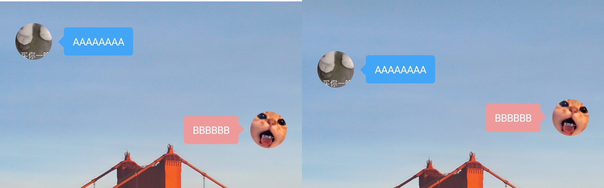

<h1 align="center">会话微件 - 使用教程</h1>

### 快速定位
* [小部件显示富文本](#小部件显示富文本)
* [气泡和弹幕式排版技巧](#气泡和弹幕式排版技巧)

### 小部件显示富文本
* 部分小部件是支持富文本显示的，例如文字类的小部件。
* 你可以在编辑文字的时候加一些标签，让文字显示更丰富，比如``、`<big>`、`<small>`、`<b>`、`<i>`这些简单的标签。
* 倒计时例子：在一起`%d`天

### 气泡和弹幕式排版技巧
* 通常可以使用两个气泡小部件组合成一组对话，通过`设置显示方向`一左一右达到效果。
* 但为了让两个小部件靠近一些，可以通过`设置垂直方向位置`，一个居下，一个居上，就可以缩小间距了。
* 左图为未设置`设置垂直方向位置`效果
