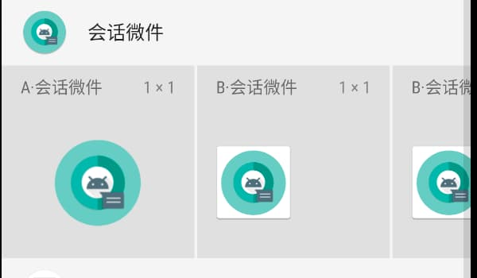
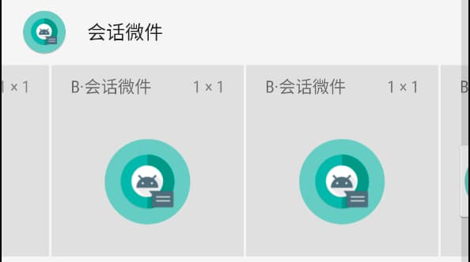
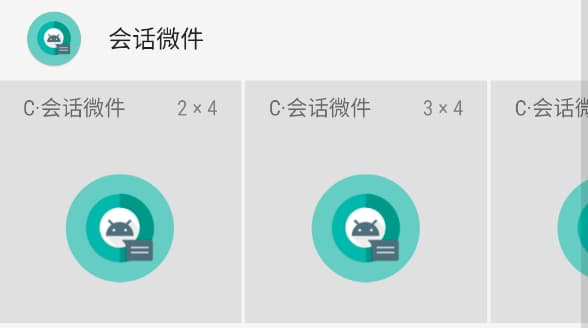

<h1 align="center">会话微件 - 使用教程</h1>

### 快速定位
* [了解会话微件的运行机制](#了解会话微件的运行机制)
* [如何在桌面添加小部件](#如何在桌面添加小部件)
* [如何调整小部件的大小](#如何调整小部件的大小)
* [如何给小部件配置功能](#如何给小部件配置功能)
* [如何编辑小部件样式与功能](#如何编辑小部件样式与功能)
* [如何更换小部件的功能](#如何更换小部件的功能)
* [小部件意外丢失如何恢复](#小部件意外丢失如何恢复)

### 了解会话微件的运行机制
* 小部件都是半小时更新一次，完全由手机系统调度，所以请把会话微件加入【后台白名单】、【关掉其电量优化】、【允许后台自启】等等。
* 桌面时钟这类需要实时更新的小部件则需要开启Keep后台服务。
* 会话微件经[Android 绿色应用公约](https://green-android.org/)审核。绿色、无毒、低耗，大可放心使用。

### 如何在桌面添加小部件
* [视频教程](http://qiniu.smarthao.com/video_add_appwidget.mp4)
1. 大部分手机都是长按桌面空白处进入桌面设置界面，该界面会有小部件选项。
2. 进入小部件列表界面后，你会看到所有APP的小部件清单。
3. 找到会话微件后将其拖放到桌面。
4. 完成桌面添加小部件。

> ### 补充内容
> * 为了兼容国内不同手机之间差异，会话微件有自己的独特之处，会话微件的小部件有三类，分别用 A、B、C 前缀命名的小部件。
> * B类是为了兼容 ColorOS(OPPO) 系统，因为该系统一个小部件不能重复>添加，所以我添加了许多一样的B类小部件，这样解决了问题。
> * C类是为了兼容部分华为手机，这部分华为手机小部件不能调整大小，所以
> 预设了各种尺寸的小部件，根据需要使用。
> 

> 
> 
> 
> 

### 如何调整小部件的大小
* [视频教程](http://qiniu.smarthao.com/video_size_appwidget.mp4)
1. 长按小部件即可进入编辑模式
2. 拖动边框调整大小

### 如何给小部件配置功能
* [视频教程](http://qiniu.smarthao.com/video_config_appwidget.mp4)
1. 先将小部件拖放至桌面
2. 单击小部件进入功能列表
3. 选择你需要的功能

### 如何编辑小部件样式&功能
* [视频教程](http://qiniu.smarthao.com/video_edit_appwidget.mp4)
1. 双击小部件即可进入编辑界面
2. 在编辑界面是你可以自由发挥，个性化编辑你的小部件

### 如何更换小部件的功能
* [视频教程](http://qiniu.smarthao.com/video_swap_appwidget.mp4)
* 小部件的功能是可以直接修改的，不需要移除，再拖放
1. 双击小部件进入编辑界面
2. 点击右上角小图标
3. 在弹出的菜单中，点击【更换微件功能】选项进入功能选取界面
4. 选择你想更换的功能即可

### 小部件意外丢失如何恢复
* [视频教程](http://qiniu.smarthao.com/video_resume_appwidget.mp4)
* 当小部件意外消失或者失误被移除，可以一键恢复小部件的数据
1. 双击小部件进入编辑界面
2. 点击右上角小图标
3. 在弹出的菜单中，点击【恢复配置】选项进入恢复数据界面
4. 选择你想要恢复的功能即可